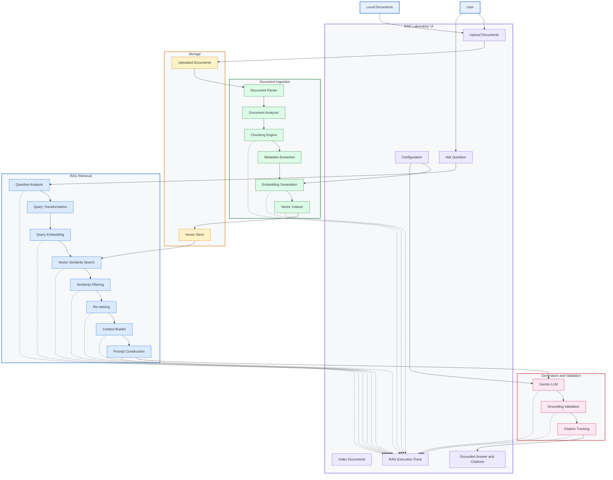

# RAG Laboratory

A transparent, local-first RAG observability application. It exposes every stage of the
pipeline — parsing, page/section-aware chunking, Gemini embeddings, vector retrieval,
similarity filtering, context construction, grounded generation, citations, and a full
execution trace — instead of hiding it behind a chatbot UI.

## Stack
- Python (FastAPI) backend
- Vanilla HTML/CSS/JS frontend (no build step)
- ChromaDB persistent local vector store
- Gemini for generation and embeddings (model IDs are configurable, see below)
- pypdf / python-docx for parsing

## Prerequisites
- Python 3.11+ (developed/tested on 3.13)
- A Gemini API key (https://aistudio.google.com/apikey)

## Installation

### Windows PowerShell
```powershell
py -m venv .venv
.\.venv\Scripts\Activate.ps1
pip install -r requirements.txt
Copy-Item .env.example .env
# edit .env and set GEMINI_API_KEY
uvicorn app.main:app --reload
```

### macOS/Linux
```bash
python3 -m venv .venv
source .venv/bin/activate
pip install -r requirements.txt
cp .env.example .env
# edit .env and set GEMINI_API_KEY
uvicorn app.main:app --reload
```

Open http://127.0.0.1:8000 in a browser.

## Environment variables (`.env`)
| Variable | Purpose | Default |
|---|---|---|
| `GEMINI_API_KEY` | Backend fallback API key. You can instead paste a key into the UI's Configuration panel for the session; it is never written to disk. | — |
| `GENERATION_MODEL` | Gemini model used for answer generation. | `gemini-3.6-flash` |
| `EMBEDDING_MODEL` | Gemini model used for embeddings. | `gemini-embedding-2` |
| `EMBEDDING_DIMENSION` | Output embedding dimensionality. | `768` |
| `CHUNK_SIZE` / `CHUNK_OVERLAP` | Chunking parameters (characters). | `800` / `120` |
| `RETRIEVAL_K` | Candidates pulled from the vector store per query. | `12` |
| `SIMILARITY_THRESHOLD` | Minimum similarity for a chunk to be treated as evidence. | `0.35` |
| `FINAL_CONTEXT_K` | Max chunks passed to the model as context. | `6` |
| `CHROMA_PATH` / `UPLOAD_PATH` | Local storage locations. | `data/index` / `data/uploads` |

If `GENERATION_MODEL` or `EMBEDDING_MODEL` is not accepted by your Gemini account/API
version, change it in `.env` — the app does not hard-code model IDs anywhere else.
Both `app/embeddings.py` and `app/rag.py` (generation) are isolated modules so the
Gemini integration can be swapped out later without touching ingestion, chunking, or
the vector store.

## Workflow
1. **Configure** — paste a Gemini API key into the Configuration panel (or rely on
   `.env`).
2. **Upload** PDF, DOCX, TXT or Markdown files. Upload parses and chunks the document
   immediately so you can inspect it, but does **not** index it yet.
3. Review the **Document & Chunk Map** — every chunk's page/section, character range,
   and size.
4. Click **Index Documents** — this embeds each chunk with Gemini and stores the
   vectors in Chroma. Already-indexed documents are skipped on subsequent clicks so
   re-indexing doesn't burn API calls unnecessarily; re-uploading a document resets its
   indexed status.
5. **Ask** a question. The response and the full **RAG Execution Trace** (query
   embedding, retrieved candidates with real similarity scores, which were
   accepted/rejected and why, the exact prompt sent to Gemini, the answer, and
   citations) are all shown — every value in the trace comes from an actual pipeline
   run, nothing is fabricated.
6. Click a `[C#]` citation in the answer, or a Source pill under it, to jump to the
   backing chunk in the trace.

## How indexing works
Each chunk gets an ID derived from the sanitized filename + a running counter
(`app/ingestion.py`), so two documents with the same base name but different
extensions (e.g. `report.pdf` and `report.docx`) get distinct IDs and don't overwrite
each other's vectors in Chroma. `/api/index` embeds chunks one document at a time,
skips documents already marked `indexed`, and persists both the vector index (Chroma,
on disk under `data/index/`) and the document/chunk metadata (`data/documents.json`)
so the Document & Chunk Explorer still reflects reality after a restart — you don't
need to re-upload or re-index after restarting the app.

## How querying works
Question → Gemini embedding → Chroma similarity search (`RETRIEVAL_K` candidates) →
chunks are split into retrieved/rejected by `SIMILARITY_THRESHOLD` → the top
`FINAL_CONTEXT_K` retrieved chunks become the context → a grounding-focused prompt
(answer only from context, cite every claim as `[C#]`, say so if evidence is
insufficient) is sent to Gemini → the response is scanned for `[C#]` citations and
checked against the chunks actually supplied, producing a PASS/REVIEW grounding
status. If no chunk clears the threshold, the app returns an explicit
insufficient-evidence message instead of calling the model to guess.

## Supported document formats
PDF (`pypdf`), DOCX (`python-docx`, chunked by heading-delimited sections), TXT and
Markdown (chunked by blank-line-delimited blocks).

## Troubleshooting
- **"Gemini API key is required"** — set it in the Configuration panel or `.env`.
- **"Upload at least one document first"** — nothing is indexed yet.
- **"No indexed chunks found"** on query — you uploaded but never clicked
  **Index Documents**.
- **Indexing failed: ...** — check the backend log; the message includes the
  underlying Gemini/Chroma error (e.g. invalid API key, invalid model name, rate
  limit). No secrets are logged.
- If the model names in `.env` are rejected by your Gemini account, switch
  `GENERATION_MODEL`/`EMBEDDING_MODEL` to model IDs your key has access to.

## Known limitations
- Single-user, local-only MVP: one in-memory session key, no auth, no multi-tenancy —
  by design.
- Embeddings are generated one chunk at a time (no batching); indexing a very large
  document set will be slow.
- DOCX parsing has no real concept of a page (Word page breaks aren't tracked without
  rendering the document), so DOCX chunks are all reported as "page 1" — use the
  `section` field for provenance within a DOCX file instead of page number.
- If a document is re-uploaded with fewer chunks than before, the old chunk IDs that
  no longer exist are not actively purged from the vector store.
- Hallucination prevention is prompt-based (explicit grounding instructions +
  citation validation), not a hard guarantee — always check the grounding status and
  the trace.

## Technical Data Flow

The diagram below illustrates the end-to-end data flow across document ingestion, indexing, retrieval, generation, and observability.

## Technical Data Flow

